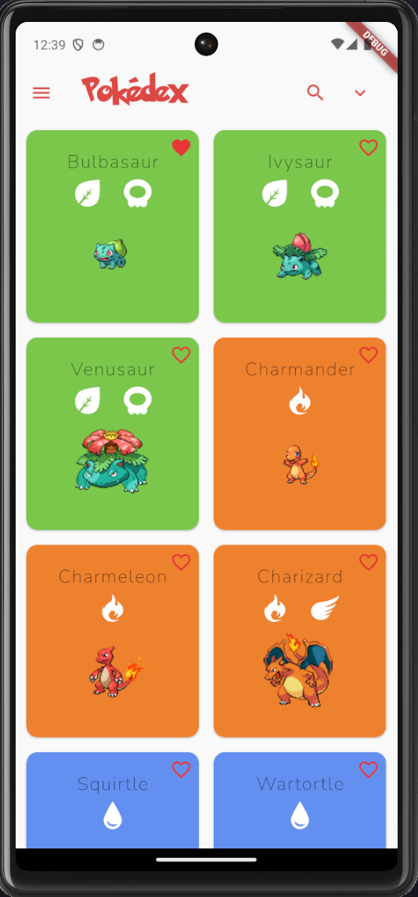
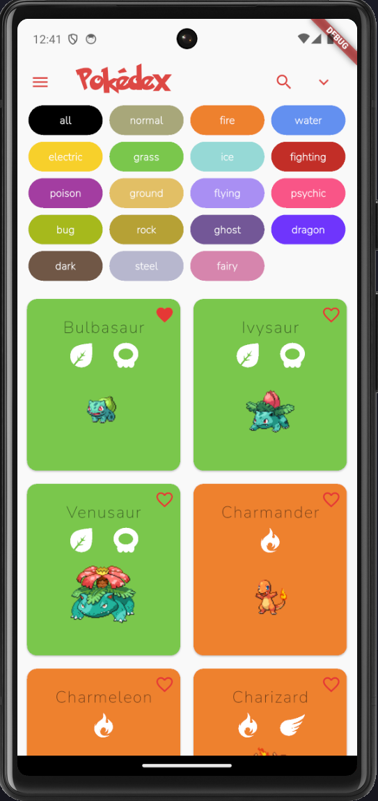
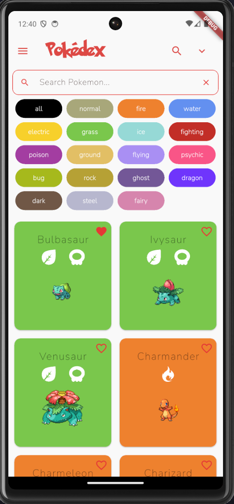
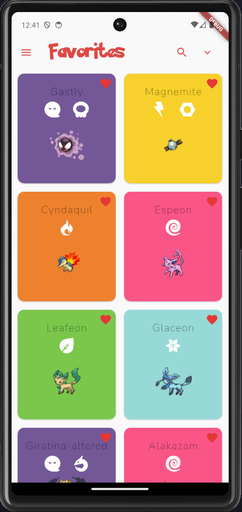
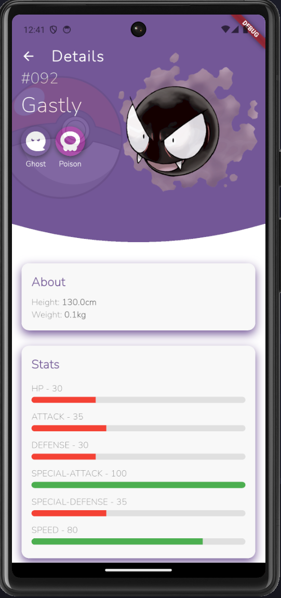
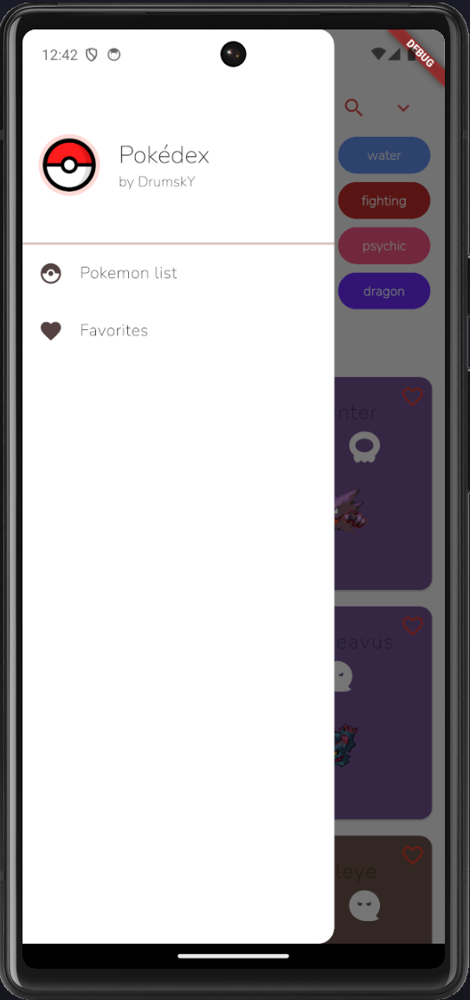

# 📱 Pokedex Flutter App

A clean and responsive **Flutter application** that lets users browse a list of Pokémon, view detailed stats, and manage their favorite Pokémon. The app uses an external API to fetch live data and stores user preferences locally.

---

## 🚀 Features

### 🔎 Pokémon List

- Browse a full list of Pokémon with names, types, and sprites.
- Filter or search Pokémon by name.
- Smooth scrolling and responsive layout.

### 📄 Pokémon Details

- Tap on any Pokémon to view detailed stats:
  - HP, Attack, Defense, Speed
  - Types and abilities
  - High-resolution artwork

### ❤️ Favorites List

- Mark any Pokémon as a favorite with a tap.
- Favorites are saved locally and persist across sessions.
- Access your personalized favorites list via a dedicated tab.

---

## 🛠️ Development Environment

| Tool              | Version / Status           |
| ----------------- | -------------------------- |
| Flutter           | Stable channel, **3.29.2** |
| Android Toolchain | Android SDK **35.0.0**     |

---

## 📷 Screenshots

List Page:




Favorites Page:


Detail Page:


Drawer:


## 🧪 Getting Started

### Prerequisites

- Flutter SDK (v3.29.2 or later)
- Android Studio / VS Code
- Android emulator or physical device

### Installation

1. Clone the repository:
   ```bash
   git clone ...
   cd flutter-pokedex
   flutter pub get
   flutter run
   ```
